# TEST

## 第五章：Higher Order Taylor Method

## Local Truncation Error

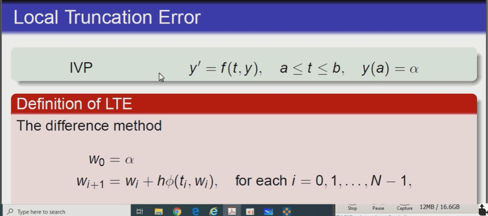

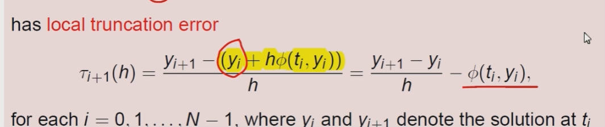

### Example

using the Euler's method

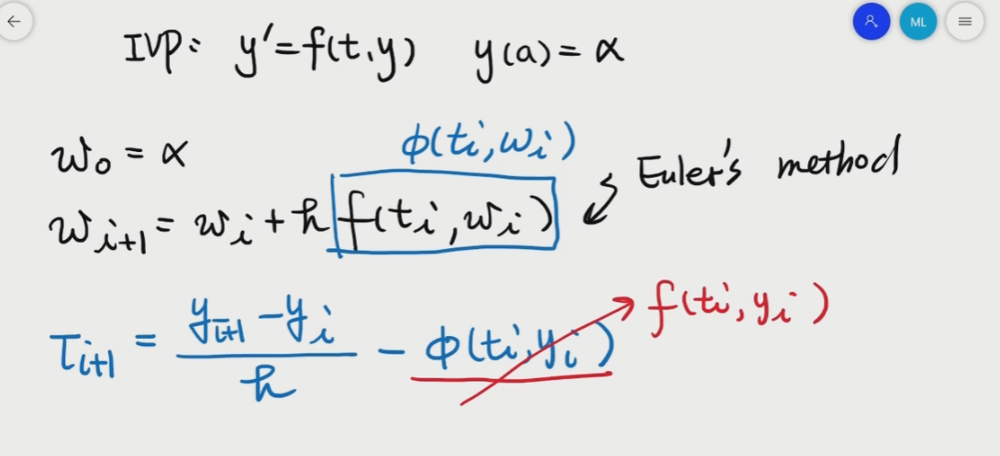

 每一步的error means in every step

### Extrapolation

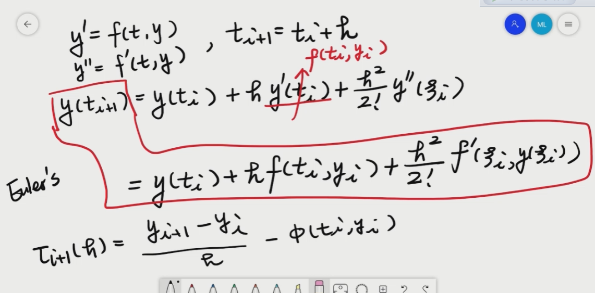

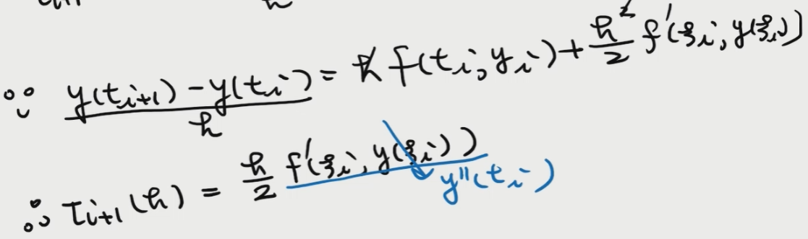

* 如何从EM推理得到LTE
* Derivative（y\(ti\)）== f\(ti,yi\)
* 所以：Derivative——Derivative（y\(ti\)） == Derivative（ f\(ti,yi\) ）

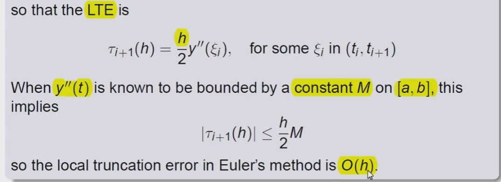

### Higher Order Taylor Method

FOR THE ORDER N IN THE TM

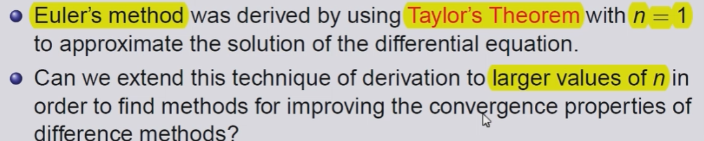

* 目标 improving the convergence properties of the difference methods

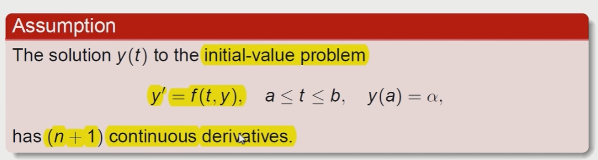

n+1 连续性

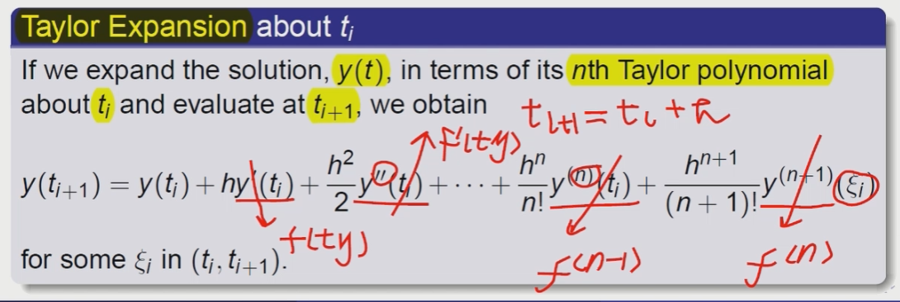

拥有更高维度的TM

### Exapmle

#### n=2

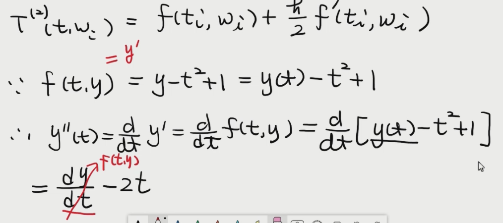

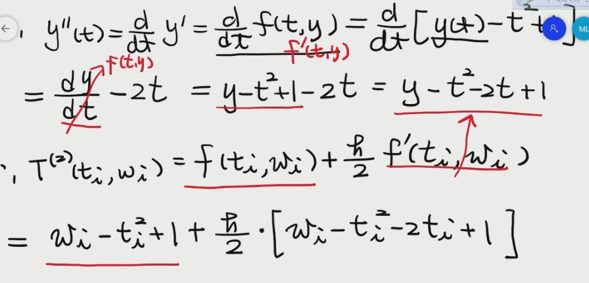

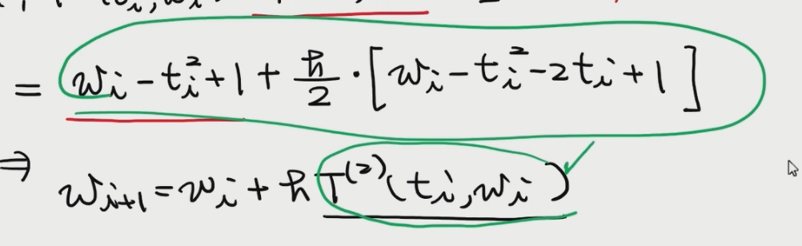

error会不断的积累

TM都会不断的积累误差

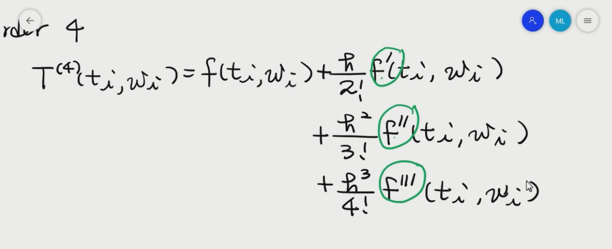

we need to compute the 4 terms for the following terms

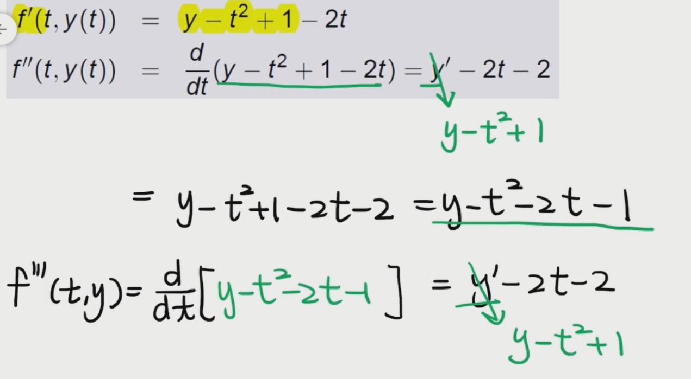

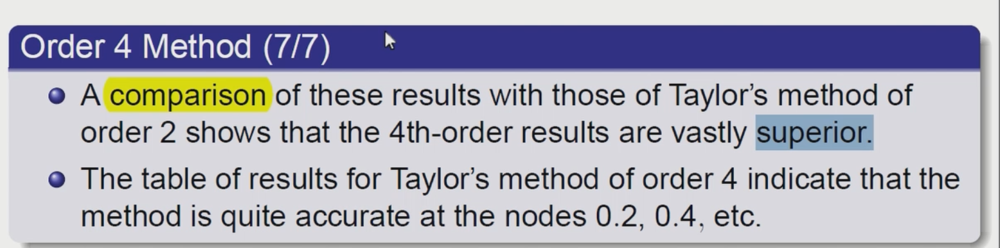

## Local Truncation Error\(Taylor\)

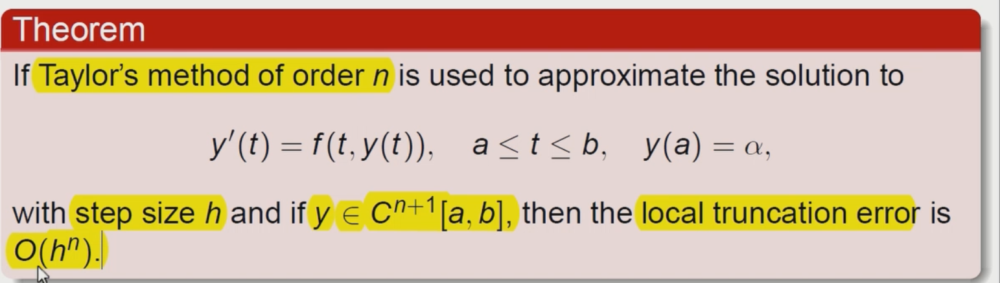

* 对于不同的order LTE 也是不同的减小的 error呈现指数级的减小

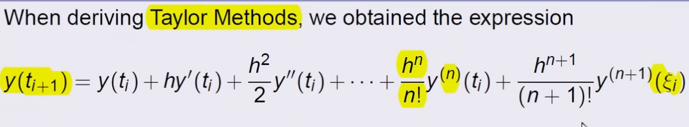

由于我们的 TM本身是有error的

分析变量和error的关系我们需要将其他的part 减去

Derivative（y\(ti\)）== f\(ti,yi\)

通过对最后一项的分析

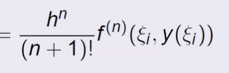

记住将h除去

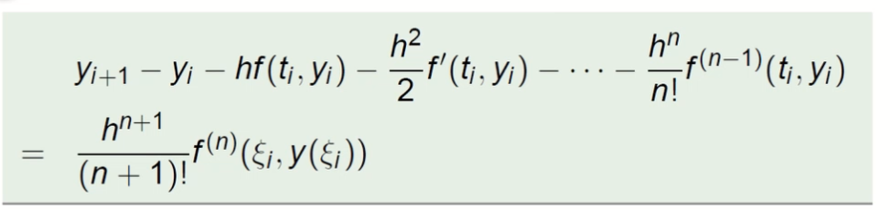

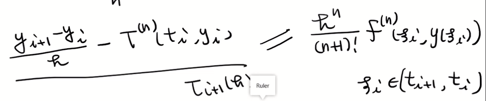

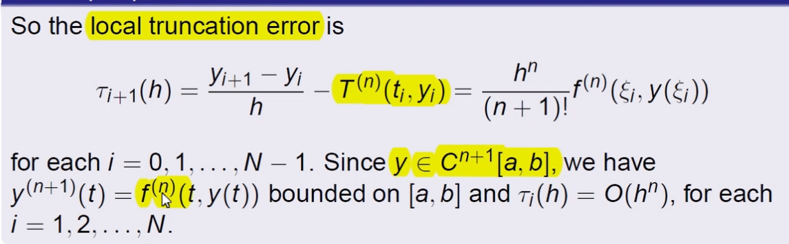

## Runge-Kutta Methods

### Intro& TM in 2 variable

#### compare with TM

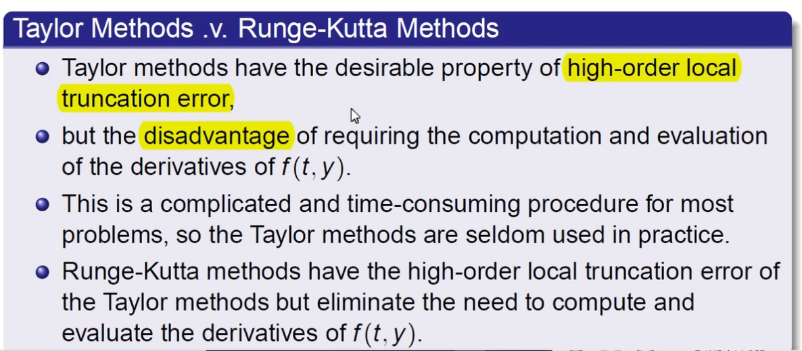

* 评估的过程非常的复杂（TM）
* 需要求导

#### 2 Variable of the TM

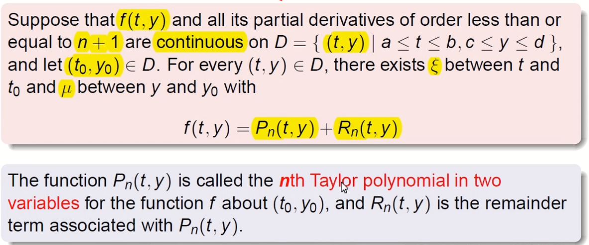

注意有reminder term存在

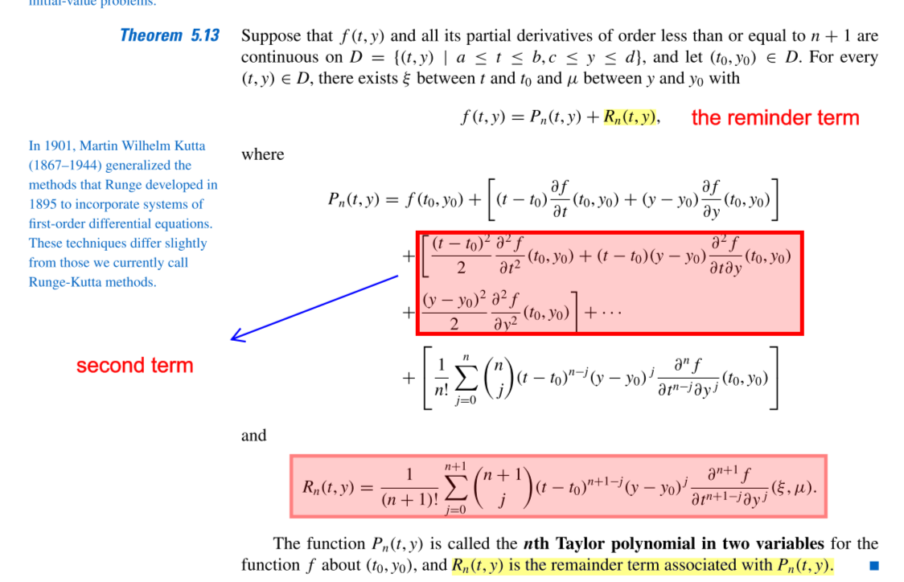

* the constant in the front is the C20 C21 C22

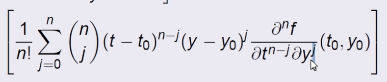

### RK M of order 2

首先我们需要知道

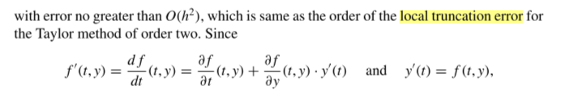

LTE for the TM of 2

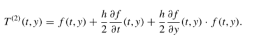

RK2 的基本构造

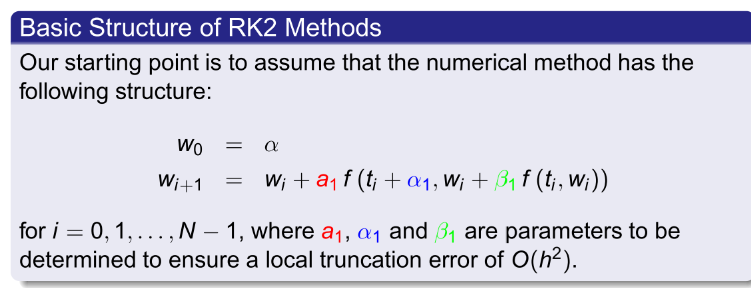

保证LTE的情况之下

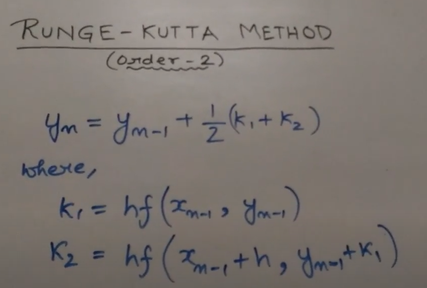

The algorithm of the RKM

### Example

### Higer-order of RKM

\#\#\#\#\#\#

